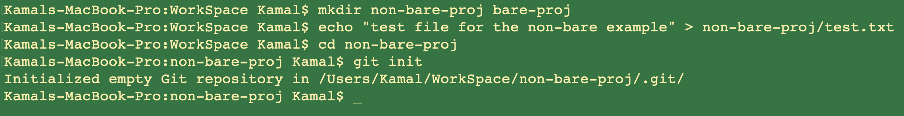

---

# Git Notes

## What is VCS ? 
VCS stands for version control systems, a tool that's used to manage differenet versions of your work as you continue developing it and it allow the users the track changes.

## Examples of VCS
- SVN 
- CVS
- Git (That's what we'll use)
- others...

## Working directory VS. Repository

There are 2 schools for defining what is the working directory and the repository :

```
-- MyProject folder
  -- file1.txt
  -- other content
  -- .git folder
```
### First School 
Here the root directory is `MyProject` which is thought of as the working directory or working tree where it contains the project files and related sub-folders excluding the `.git` folder, where the `.git` folder is the repository where you store the versions of your project. 

In strict sense .git/ subdirectory doesn't belong to the working tree, and it resides inside the working directory.

### Second school

we use relaxed terminology, so we often call the entire working tree + .git/ as "repository" or "project" or whatever. So when we refer to the repository we actually refer to the root parent directory with all it's subdirectories including `.git` folder.

### Refs
- https://bit.ly/meduim_Anna_tech_journey
- https://stackoverflow.com/a/59349415
<br><br>

**We will use the `first definition` through out this course .**

## Repository location

There are different options you can find, depending on your requirements and needs.

1. Local repository just on your machine, just for local use. (Bare repository)
2. Shared repository resides on a team member computer.
3. Located on a server that can be accessed by the users.
4. Using some cloud service provider like https://github.com with backup and management services for your working tree.

## Bare repository !! What the hell is that ?!
Repositories can be divided into two types based on the usage on a server. These are:
- Non-bare Repositories
- Bare Repositories

### Non-bare repository
It's a usual .git folder created to keep track of the changes on the working tree directory. You can use the usual git commands with it to store changes and keep track of the different versions of your application.

### bare repository 
A bare git repository is the one which technically does not reside into any workspace but the parent directory itself became a repository and not contains any working tree. In this bare-repo none of the git commands like git status,git commit, etc. will work because we do not have any workspace. And these commands are workspace specific. So we have a directory not a working tree (workspace) which contains only the structure of a typical `.git` repo without any other file or project. this type of repos is only used as the usual github repos but in this case it's local.


## Examples of non-bare and bare repos
```shell
# go to the home directory
$ cd ~

# making a workspace folder to contain our data
$ mkdir Workspace
$ cd Workspace

# create 2 folders (non-bare-proj, bare-proj)
$ mkdir non-bare-proj bare-proj

# make test file with some content inside the non-bare-proj
$ echo "test file for the non-bare example" > non-bare-proj/test.txt

# create a local .git repo inside the non-bare-proj
$ cd non-bare-proj
$ git init

# making the bare-proj folder as a bare-repo
$ cd ../bare-proj
$ git init --bare
------ OR ------
$ git init
$ git config core.bare true

# Now we have :
# non-bare-proj folder which is a working tree containing our project files (text.txt) and a .git repository that tracks the changes we make in our project and we can add commits to it and working with it as usual.
# a bare bare-proj repository which isn't a workspace. It contains only the internal structure of a typical .git repo. It's only used as a shared place to store your commits like you do with github repos but now it's local.
```

### Images for the creating the repos
<figure style="margin: auto">
  
  <figcaption>Creating the folders, adding test.txt file containing some words to the non-bare folder and making .git repo.</figcaption>
</figure>
<br>
<figure style="margin: auto">
  
  <figcaption>preparing the bare folder, as we see the structure of the bare-proj folder is now like a typical .git repo. This folder now became like our local github repo .</figcaption>
</figure>

## pushing changes to the bare repo
we now have our project (non-bare-repo) version controlled using Git and we need to make changes and push those changes to the (bare-proj) repo (out local repo).
```bash
# switching to the non-bare-proj
$ cd ../non-bare-proj
# start tracking the test.txt file by adding index to this file
# the "git add"
$ git add test.txt
# 
$ git commit -m "initial commit"
```

we need to link our local repo to the bare repo as it's now working as a local github repo
```bash
$ git remote add origin ../bare-proj/
$ git push -u origin main
```

<figure style="margin: auto">
  
  <figcaption>From the non-bare-proj <b>folder</b>, create the first commit and push it to the bare-repo <b>repository</b> .</figcaption>
</figure>
<hr>
If we create anther folder besides `non-bare-proj` and `bare-proj` then we can **pull** the changes from the 'bare-proj' repo to this new folder and start working on the files and push them back and so on.

You can see a Demo through this [Link](https://drive.google.com/file/d/19wHncnLR1QLOVaD3jHU6hLSEES6DfKfy/view?usp=sharing). 

<br>


## Branching
used for developing new features and then merge back this new branch with the main branch. you must take care of the conflicts and resolve them correctly.

### some useful commands
```bash
# show which branch you are currently in
$ git branch

# creating a new branch and switch to this branch
$ git checkout -b new-branch-name

# switching to an existing branch-name
$ git branch branch-name

# mergin branch-name into the current branch
$ git merge branch-name

# deleting a branch
$ git branch -d branch-name

# see the differences between the 2 branches
$ git diff branch-name1 branch-name2

# pushing a specific branch
$ git push -u origin branch-name
```

***You must resolve the conflicts happened when merging branches before merging them .***